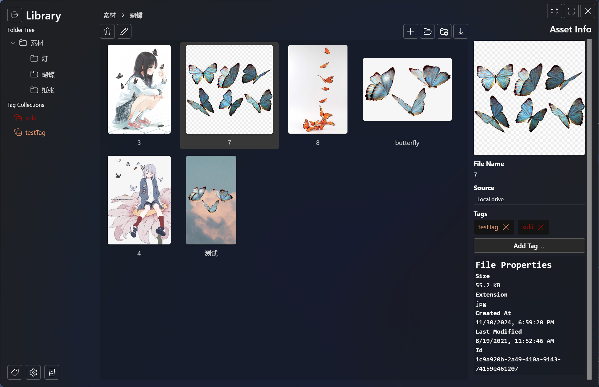

    <image src="./src-tauri/icons/snowflake.svg" width="200px" height="200px"/>

# Snowflake

An asset management tool for designers and artists, free and open-source forever.

Build for creativity, not for profit.

> [!WARNING]
> This application is still at pre-alpha stage, and under heavy development. Think twice before storing anything important.
>
> Backward compatibility is only available for the previous version.

## Localization

If you are interested in contributing to the localization of this app, you can go to `public/locales` .

`if (the language you are contributing to are not found) {`

- Create a folder named the language, for example `jp` .
- Create a file named `translation.json` in that folder, and type a pair of curly braces in `translation.json` .

`}`

- Go to `tools/localization_sync.py` and run it.
- Go back to `translation.json` and start translation.
