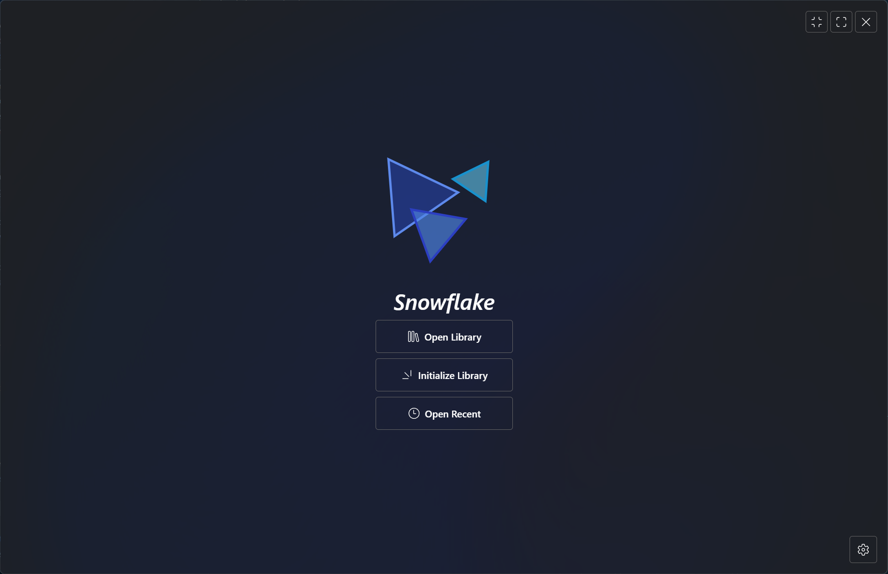
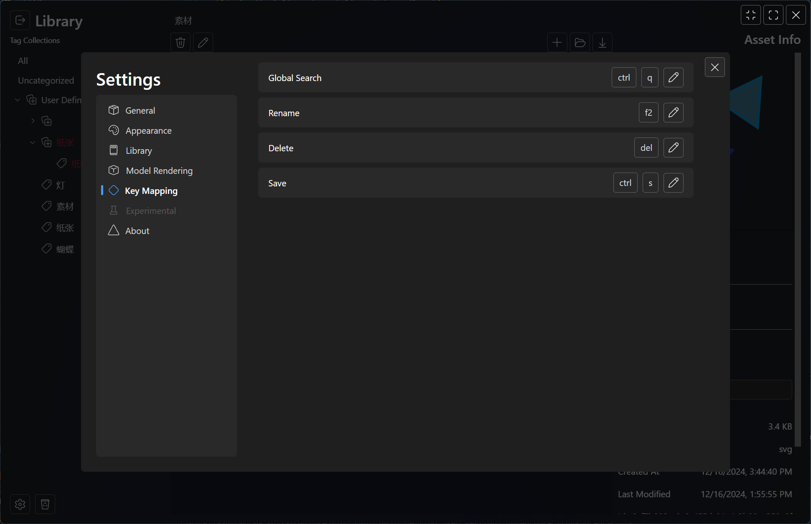

    <image src="./src-tauri/icons/snowflake.svg" width="200px" height="200px"/>

# Snowflake

An asset management tool for designers and artists, free and open-source forever.

Build for creativity, not for profit.

> [!WARNING]
> This application is still at beta stage. Think twice before storing anything important.
>
> Backward compatibility is only available for the previous version.

## Features

- Quick ref, open an asset in a separate window which is always on top of other windows.
- Tagging assets, quick ref them at once.
- Support for 3d models. Previewing it and taking screenshots.
- Recycle bin for removed assets, rather than delete them permanently from file system.
- Import assets from local drive or from web urls.

## Screenshots

## Supported Asset Formats

- Raster Graphics
  - apng
  - png
  - avif
  - gif
  - jpg
  - jpeg
  - jfif
  - pjpeg
  - pjp
  - webp
  - bmp
  - ico
  - cur
  - tif
  - tiff
- Vector Graphics
  - svg
- Models
  - glb

## Localization

If you are interested in contributing to the localization of this app, you can go to `public/locales` .

`if (the language you are contributing to are not found) {`

- Create a folder named the language, for example `jp` .
- Create a file named `translation.json` in that folder, and type a pair of curly braces in `translation.json` .

`}`

- Go to `tools/localization_sync.py` and run it.
- Go back to `translation.json` and start translation.

## Building

- Install [Rust toolchain](https://www.rust-lang.org/).
- Install [Deno](https://deno.com/).
- Clone this repository.
- Open this repo in terminal.
- Run `deno install`
- Run `deno task tauri dev` or `deno task tauri build` if you want to get an executable application.
